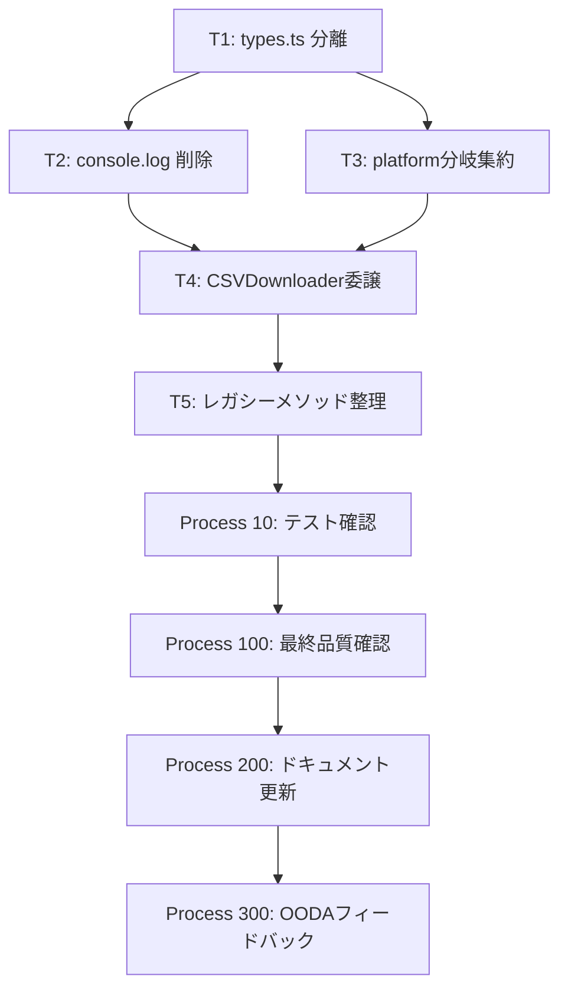

# Commander's Intent

fetcher.ts（1352行）を600行以下に削減し、責務を適切に分離する。
現在の問題：
1. 型定義が fetcher.ts に集中しており、循環依存のリスクがある
2. console.log が82個存在しデバッグコードが本番コードに混在している
3. platform分岐ロジックが launchBrowser 内に直書きされており、platform.ts の getBrowserLaunchOptions が未活用
4. CSVダウンロード責務が fetcher.ts と csv-downloader.ts に重複している

**最終状態**: `deno task csv-download` が macOS で正常動作し、fetcher.ts が600行以下でクリーンになること。

---

# Context

## 概要

- プロジェクト: TaskChute Cloud連携CLIツール（Deno + Playwright）
- 言語: TypeScript / Deno
- 対象ファイル: `src/fetcher.ts`（主）、`src/types.ts`（新規）、その他関連ファイル

## 必須ルール

1. **WSL対応は変更禁止** - platform分岐の結果は維持、ロジックの再配置のみ
2. **`authenticated-fetcher.ts` / `session-manager.ts` は削除禁止**
3. **新機能追加禁止** - リファクタリングのみ
4. **`auth.ts` の外部インターフェース変更禁止** - シグネチャ維持
5. **T2とT3は fetcher.ts を同時編集するため逐次実行** - 並列不可

## 開発ゴール

| ID | ゴール | 検証コマンド |
|----|--------|------------|
| G1 | csv-download が macOS で正常動作 | `deno task csv-download` |
| G2 | fetcher.ts が600行以下 | `wc -l src/fetcher.ts` |
| G3 | テスト全pass | `deno task test` |
| G4 | console.log ゼロ | `grep -c 'console\.log' src/fetcher.ts` |
| G5 | platform分岐ゼロ | `grep -c 'isMac\|isWSL\|isWSLg' src/fetcher.ts` |
| G6 | types.ts に6 interface 定義 | `grep -c 'export interface' src/types.ts` |

---

# References

## 参照ファイル（変更禁止）

| ファイル | 役割 | 重要箇所 |
|---------|------|---------|
| `src/platform.ts` | プラットフォーム検出・起動オプション生成 | L10: `PlatformInfo`, L31: `detectPlatform()`, L217: `getBrowserLaunchOptions()` |
| `src/auth.ts` | 認証・セッション管理 | L25-29: `AuthResult`（外部シグネチャ） |
| `src/csv-downloader.ts` | CSVダウンロード処理 | L93: `CSVDownloader` class, L336-399: `downloadCSV()`, L457-526: `executeDownload()`, L472: `waitForEvent('download')` |

## 実装ファイル（変更対象）

| ファイル | 現状 | 変更内容 |
|---------|------|---------|
| `src/fetcher.ts` | 1352行、型・実装混在 | 型を types.ts へ移動、console.log削除、platform分岐整理、CSVDownloader委譲 |
| `src/types.ts` | 存在しない（新規作成） | 6 interface を集約 |
| `src/auth.ts` | `AuthResult` が fetcher.ts と名前衝突 | `AuthResult` → `AuthSessionResult` に rename（内部のみ） |
| `src/config.ts` | L3-4: `LoginCredentials`, `FetcherOptions` import | types.ts からの import に変更 |
| `src/csv-parser.ts` | L7: `TaskData` import | types.ts からの import に変更 |
| `src/authenticated-fetcher.ts` | L10: 4型 import | types.ts からの import に変更 |
| `src/csv-downloader.ts` | L8-9: `TaskData` import | types.ts からの import に変更 |
| `src/cli.ts` | L4: `TaskChuteDataFetcher` import | T5で不要メソッド削除後に確認 |

## テストファイル（影響範囲）

| ファイル | import 対象 | 変更要否 |
|---------|-----------|---------|
| `tests/fetcher_test.ts` | `TaskChuteDataFetcher`, `FetcherOptions`, `TaskData` | **不要**（fetcher.ts で re-export するため） |
| `tests/fetcher_wsl_test.ts` | `TaskChuteDataFetcher` | **不要** |
| `tests/csv_download_improved_test.ts` | dynamic import（ファイルパス変更注意） | T4後に確認 |
| `tests/login_with_storage_state_test.ts` | dynamic import | T1後に確認 |
| `tests/session_manager_test.ts` | dynamic import | T1後に確認 |

---

# DAG Execution



**注意**: T2 と T3 はどちらも `src/fetcher.ts` を編集するため、実際には**逐次実行**（T2完了後にT3）。

---

# Progress Map

| Process | 説明 | Status | 依存 |
|---------|------|--------|------|
| 1 | T1: types.ts 分離 + re-export | DONE | なし |
| 2 | T2: console.log 82個削除 | DONE | Process 1 |
| 3 | T3: platform分岐集約 | DONE | Process 2 |
| 4 | T4: CSVDownloader委譲 | DONE | Process 3 |
| 5 | T5: レガシーメソッド整理 | DONE | Process 4 |
| 10 | テスト全pass確認・修正 | DONE | Process 5 |
| 100 | 最終品質確認 | DONE | Process 10 |
| 200 | CLAUDE.md・README更新 | DONE | Process 100 |
| 300 | OODAフィードバック | DONE | Process 200 |

---

# Test Viewpoints

| 観点 | テストファイル | チェック内容 |
|------|-------------|------------|
| Fetcherクラス基本動作 | `tests/fetcher_test.ts` | `TaskChuteDataFetcher` インスタンス化、`FetcherOptions` 型 |
| WSL環境対応 | `tests/fetcher_wsl_test.ts` | WSL環境でのブラウザ起動オプション |
| CSVダウンロード | `tests/csv_download_improved_test.ts` | `downloadCSV()` 正常系・異常系 |
| ログイン状態管理 | `tests/login_with_storage_state_test.ts` | セッション維持 |
| セッション管理 | `tests/session_manager_test.ts` | セッション永続化 |
| import パス整合性 | 全テストファイル | types.ts re-export 経由で破壊なし |

---

# COP (Common Operating Picture)

## 現在の問題構造

```
src/fetcher.ts (1352行)
├── interface定義 x6 (L13-71)      ← types.ts に移動
├── class TaskChuteDataFetcher (L80)
│   ├── launchBrowser (L160-349)   ← platform分岐を getBrowserLaunchOptions に委譲
│   │   ├── if isMac (L193)        ← 削除
│   │   ├── } else if isWSLg (L218)← 削除
│   │   └── } else if isWSL (L277) ← 削除
│   ├── getTaskDataFromCSV (L583-1043, 461行) ← CSVDownloader に委譲
│   ├── getTaskData (L1050)        ← T5で削除検討
│   ├── getPageHTML (L519)         ← T5で削除検討
│   └── getElements (L546)         ← T5で削除検討
└── console.log x82               ← 全削除
```

## 名前衝突問題

| ファイル | interface名 | 内容 |
|---------|-----------|------|
| `src/auth.ts` L25-29 | `AuthResult` | `{success: boolean, email?: string, error?: string}` |
| `src/fetcher.ts` L61 | `AuthResult` | `{success: boolean, token?: string, finalUrl?: string, error?: string}` |

**解決策**: `auth.ts` の `AuthResult` を `AuthSessionResult` に rename（内部参照のみ変更）。`fetcher.ts` の `AuthResult` は `types.ts` に移動してそのまま維持。

---

# Processes

## Process 1: T1 - types.ts 分離

### 対象ファイル
- `src/types.ts`（新規作成）
- `src/fetcher.ts`（L13-71 の interface 削除 + re-export 追加）
- `src/auth.ts`（AuthResult → AuthSessionResult rename）
- `src/config.ts`（L3-4 の import 先変更）
- `src/csv-downloader.ts`（L8-9 の import 先変更）
- `src/csv-parser.ts`（L7 の import 先変更）
- `src/authenticated-fetcher.ts`（L10 の import 先変更）

### 実施内容

#### Step 1-1: src/types.ts 新規作成

以下の6 interface を `src/fetcher.ts` からそのままコピーして作成:

```typescript
// src/types.ts
// Why: 型定義を fetcher.ts から分離し、循環依存を防ぎ再利用性を高める

export interface FetcherOptions {
  // (fetcher.ts L13-23 の内容をそのままコピー)
}

export interface TaskData {
  // (fetcher.ts L24-39 の内容をそのままコピー)
}

export interface FetchResult<T = any> {
  // (fetcher.ts L40-51 の内容をそのままコピー)
}

export interface NavigationResult {
  // (fetcher.ts L52-60 の内容をそのままコピー)
}

export interface AuthResult {
  // (fetcher.ts L61-70 の内容をそのままコピー)
  // ※ auth.ts の AuthResult とは別物: {success, token?, finalUrl?, error?}
}

export interface SaveResult {
  // (fetcher.ts L71-79 の内容をそのままコピー)
}
```

#### Step 1-2: src/fetcher.ts の変更

1. L1-8 の import 文に `import type { ... } from './types.ts'` を追加
2. L13-79 の 6 interface 定義を削除
3. ファイル末尾（または import 直後）に re-export を追加:

```typescript
// re-export for backward compatibility (テストの import パス変更不要)
export type { FetcherOptions, TaskData, FetchResult, NavigationResult, AuthResult, SaveResult } from './types.ts';
```

**重要**: re-export を追加することで `tests/fetcher_test.ts` 等の既存テストの import パスを変更不要にする。

#### Step 1-3: src/auth.ts の変更

- L25: `export interface AuthResult` → `export interface AuthSessionResult` に rename
- ファイル内の全参照箇所を `AuthSessionResult` に変更（内部のみ）
- 外部公開シグネチャが変わらないよう、必要であれば type alias で互換性を維持:
  ```typescript
  // Why: fetcher.ts の AuthResult と名前衝突を解消するために rename
  export interface AuthSessionResult { ... }
  // backward compatibility alias（もし外部から AuthResult が参照されている場合）
  export type AuthResult = AuthSessionResult;
  ```

#### Step 1-4: 各ファイルの import 先変更

```typescript
// src/config.ts (L3-4)
// 変更前: import { LoginCredentials } from './fetcher.ts'
//         import { FetcherOptions } from './fetcher.ts'
// 変更後: import type { FetcherOptions } from './types.ts'
// LoginCredentials の定義元を確認して対応

// src/csv-parser.ts (L7)
// 変更前: import { TaskData } from './fetcher.ts'
// 変更後: import type { TaskData } from './types.ts'

// src/authenticated-fetcher.ts (L10)
// 変更前: import { FetcherOptions, TaskData, FetchResult, NavigationResult } from './fetcher.ts'
// 変更後: import type { FetcherOptions, TaskData, FetchResult, NavigationResult } from './types.ts'

// src/csv-downloader.ts (L8-9)
// 変更前: import { TaskData } from './fetcher.ts'
// 変更後: import type { TaskData } from './types.ts'
```

### 完了条件

```bash
# 6 interface が types.ts に存在する
grep -c 'export interface' src/types.ts
# => 6

# fetcher.ts に re-export が存在する
grep 'export type' src/fetcher.ts
# => export type { FetcherOptions, TaskData, ... } from './types.ts';

# コンパイルエラーなし
deno check src/fetcher.ts src/auth.ts src/config.ts src/csv-downloader.ts src/csv-parser.ts src/authenticated-fetcher.ts

# テストpass
deno task test
```

### リスクと注意事項

- `LoginCredentials` の定義元を事前確認（`src/config.ts` L3 の import 元）
- `auth.ts` の `AuthResult` が外部から `AuthResult` として import されている箇所を全検索してから rename
  ```bash
  grep -r 'AuthResult' src/ tests/
  ```
- dynamic import を使用するテスト（`csv_download_improved_test.ts` 等）はファイルパス変更がないため影響なし

### Red/Green/Refactor チェックリスト

- [ ] Red: types.ts 作成前に `deno check` がエラーになることを確認（不要、スキップ）
- [ ] Green: types.ts 作成 + fetcher.ts の re-export 追加で `deno task test` pass
- [ ] Refactor: import 文の整理（`import type` を使用）

---

## Process 2: T2 - デバッグコード除去

### 対象ファイル
- `src/fetcher.ts`（console.log 82個を削除）

### 実施内容

#### Step 2-1: console.log の全削除

```bash
# 事前確認: 何行あるか
grep -n 'console\.log' src/fetcher.ts | wc -l
# => 82

# console.error の行数確認（削除しないこと）
grep -n 'console\.error' src/fetcher.ts | wc -l
```

削除方針:
- `console.log(...)` の行を全削除
- `console.error(...)` は**維持**
- `console.warn(...)` は**維持**
- 削除後に前後のコードが論理的に正しいか確認（特に条件分岐内の単独 console.log）

**注意**: 以下のパターンに注意:
```typescript
// パターン1: 単独行 → そのまま削除
console.log('message');

// パターン2: 変数代入と混在 → 削除のみ（変数は残す）
const result = await something();
console.log('result:', result);  // この行だけ削除

// パターン3: try-catch 内 → 削除しても catch ブロックの構造は維持
try {
  await something();
  console.log('success');  // この行だけ削除
} catch (e) {
  console.error('error:', e);  // これは維持
}
```

### 完了条件

```bash
# console.log がゼロになること
grep -c 'console\.log' src/fetcher.ts
# => 0

# console.error は維持されていること
grep -c 'console\.error' src/fetcher.ts
# => (削除前と同数)

# 動作確認
deno task test
```

### リスクと注意事項

- console.log が条件分岐の唯一の文になっている場合は空ブロックが残る → 空ブロックを整理
- デバッグ用の変数（console.log のためだけに作られた変数）があれば一緒に削除
- Process 1（T1）完了後に実施すること

### Red/Green/Refactor チェックリスト

- [ ] Green: console.log 全削除後に `deno task test` pass
- [ ] Refactor: 空ブロック・孤立変数の整理

---

## Process 3: T3 - platform分岐集約

### 対象ファイル
- `src/fetcher.ts`（launchBrowser メソッド L160-349 の分岐を整理）
- `src/platform.ts`（確認のみ、変更なし）

### 実施内容

#### Step 3-1: platform.ts の getBrowserLaunchOptions を確認

```bash
# platform.ts L217 付近を確認
# getBrowserLaunchOptions(platformInfo: PlatformInfo) の戻り値型を確認
grep -n 'getBrowserLaunchOptions\|BrowserContextOptions\|LaunchOptions' src/platform.ts | head -20
```

`getBrowserLaunchOptions` の戻り値が何を返すかを確認し、`launchBrowser` 内での使い方に合わせる。

#### Step 3-2: fetcher.ts の launchBrowser 変更

**変更前** (L160-349 の概略):
```typescript
async launchBrowser(options: FetcherOptions): Promise<void> {
  const platformInfo = detectPlatform();

  if (platformInfo.isMac) {
    // Mac固有の起動設定 (L193-217)
    // ... 約25行
  } else if (platformInfo.isWSLg) {
    // WSLg固有の起動設定 (L218-276)
    // ... 約60行
  } else if (platformInfo.isWSL) {
    // WSL固有の起動設定 (L277-348)
    // ... 約70行
  }

  // 共通処理
}
```

**変更後** (概略):
```typescript
async launchBrowser(options: FetcherOptions): Promise<void> {
  const platformInfo = detectPlatform();
  // Why: platform分岐ロジックを platform.ts に集約。getBrowserLaunchOptions は既に L217 に実装済み
  const launchOptions = getBrowserLaunchOptions(platformInfo);

  // launchOptions を使ってブラウザ起動
  // 共通処理のみここに残す
}
```

**重要**: `getBrowserLaunchOptions` の戻り値の型と、`launchPersistentContext` や `launch` への渡し方を事前確認。
戻り値が `LaunchOptions` や `BrowserContextOptions` のどちらかによって、呼び出し方が変わる。

#### Step 3-3: import 確認

`src/fetcher.ts` の L5 にすでに `getBrowserLaunchOptions` が import されているため、import 変更は不要:
```typescript
import { detectPlatform, getBrowserLaunchOptions, convertToWindowsPath } from './platform.ts';
```

### 完了条件

```bash
# platform分岐がゼロになること
grep -c 'isMac\|isWSL\|isWSLg' src/fetcher.ts
# => 0

# 動作確認
deno task test
deno check src/fetcher.ts
```

### リスクと注意事項

- WSL 環境での動作は変更しないこと（getBrowserLaunchOptions の戻り値がWSL設定を含んでいることを確認）
- launchBrowser 内に platform分岐以外のロジック（例: SingletonLock 対応）が含まれている場合は維持
- Process 2（T2）完了後に実施すること（fetcher.ts の同時編集を避けるため）

### Red/Green/Refactor チェックリスト

- [ ] Green: platform分岐削除後に `deno task test` pass
- [ ] Refactor: launchBrowser メソッドが簡潔になっていること（目標: 50行以下）

---

## Process 4: T4 - CSVDownloader委譲

### 対象ファイル
- `src/fetcher.ts`（getTaskDataFromCSV L583-1043 を CSVDownloader に委譲）
- `src/csv-downloader.ts`（確認のみ、必要に応じて minor 修正）

### 実施内容

#### Step 4-1: csv-downloader.ts の現状確認

```bash
# CSVDownloader クラスの public インターフェースを確認
grep -n 'public\|async\|constructor' src/csv-downloader.ts | head -30

# waitForEvent パターンを確認（L472付近）
# クリック前に waitForEvent('download') を登録するパターンが正しい Playwright のパターン
```

**正しい Playwright ダウンロードパターン**:
```typescript
// 正: クリック前に Promise を作成（イベントを先に登録）
const [download] = await Promise.all([
  page.waitForEvent('download'),  // 先に登録
  page.click('button#download'),  // その後クリック
]);

// 誤: クリック後に waitForEvent（イベントが発火してから登録では取れない場合がある）
await page.click('button#download');
const download = await page.waitForEvent('download');  // 競合状態
```

csv-downloader.ts の L472 がこのパターンに従っているか確認する。

#### Step 4-2: getTaskDataFromCSV の委譲

**変更前** (fetcher.ts L583-1043, 461行):
```typescript
async getTaskDataFromCSV(options: FetcherOptions): Promise<FetchResult<TaskData[]>> {
  // ... 461行の実装
  // - DatePicker操作
  // - ダウンロードボタン押下
  // - ファイル検出
  // - CSVパース
}
```

**変更後** (fetcher.ts):
```typescript
async getTaskDataFromCSV(options: FetcherOptions): Promise<FetchResult<TaskData[]>> {
  // Why: CSV ダウンロード責務を CSVDownloader に集約。fetcher.ts は orchestration のみ担当
  const downloader = new CSVDownloader(this.page, options);
  return await downloader.downloadCSV();
}
```

**注意**: `CSVDownloader.downloadCSV()` の引数と戻り値が `getTaskDataFromCSV` と一致するか確認。
不一致の場合はアダプタ層を書いて変換する（`csv-downloader.ts` の変更は最小限に）。

#### Step 4-3: import 追加

fetcher.ts に CSVDownloader の import を追加:
```typescript
import { CSVDownloader } from './csv-downloader.ts';
```

### 完了条件

```bash
# getTaskDataFromCSV が短くなっていること（5行以内）
grep -n -A 10 'async getTaskDataFromCSV' src/fetcher.ts

# 動作確認
deno task csv-download

# テストpass
deno task test
```

### リスクと注意事項

- `CSVDownloader` が `page` オブジェクトをコンストラクタで受け取るかを確認（L93 付近）
- `downloadCSV()` の戻り値型が `FetchResult<TaskData[]>` と一致しているか確認
- `CSVDownloader` が初期化に `this.page` を必要とする場合、`launchBrowser` 完了前に呼ばれないよう注意
- Process 3（T3）完了後に実施すること

### Red/Green/Refactor チェックリスト

- [ ] Green: CSVDownloader委譲後に `deno task csv-download` 正常完了
- [ ] Green: `deno task test` pass
- [ ] Refactor: getTaskDataFromCSV が5行以内になっていること

---

## Process 5: T5 - レガシーメソッド整理

### 対象ファイル
- `src/fetcher.ts`（未使用メソッドの削除）
- `src/cli.ts`（参照確認）

### 実施内容

#### Step 5-1: 未使用メソッドの特定

削除候補メソッド:
- `getTaskData` (L1050)
- `getPageHTML` (L519)
- `getElements` (L546)
- `getDailyTaskStats` (L1275)
- `saveHTMLToFile` (L1292)
- `saveJSONToFile` (L1309)
- `takeScreenshot` (L1328)

各メソッドの使用箇所を確認:
```bash
# 各メソッドの参照箇所を確認
grep -rn 'getTaskData\|getPageHTML\|getElements\|getDailyTaskStats\|saveHTMLToFile\|saveJSONToFile\|takeScreenshot' src/ tests/
```

#### Step 5-2: cli.ts の参照確認

```bash
# cli.ts から TaskChuteDataFetcher のどのメソッドが呼ばれているか
grep -n 'fetcher\.' src/cli.ts
```

cli.ts で参照されているメソッドは削除禁止。

#### Step 5-3: 未使用メソッドの削除

参照がないメソッドのみ削除。削除後:
```bash
# 行数確認
wc -l src/fetcher.ts
# 目標: 600行以下
```

### 完了条件

```bash
# 行数が600以下
wc -l src/fetcher.ts
# => 600以下

# テストpass
deno task test

# コンパイルエラーなし
deno check src/fetcher.ts src/cli.ts
```

### リスクと注意事項

- デバッグ用途（`deno task save-html`）で使われているメソッドは削除禁止
- `cli.ts` 以外のファイル（`authenticated-fetcher.ts` 等）からの参照も確認
- 削除前に全参照を grep で確認してから削除

### Red/Green/Refactor チェックリスト

- [ ] Green: メソッド削除後に `deno task test` pass
- [ ] Refactor: `wc -l src/fetcher.ts` ≤ 600

---

## Process 10: テスト全pass確認・修正

### 実施内容

```bash
# 全テスト実行
deno task test

# 失敗したテストの詳細確認
deno test --allow-all tests/<failing_test>.ts

# 型チェック
deno check src/
```

### 対応方針

| 失敗パターン | 対応 |
|------------|------|
| import エラー | types.ts の re-export を確認 |
| 型不一致 | 変更したインターフェースとの整合性確認 |
| ランタイムエラー | スタックトレースから原因特定 |
| dynamic import エラー | ファイルパスが変わっていないか確認 |

### 完了条件

```bash
deno task test
# => 全11ファイル pass
```

---

## Process 100: 最終品質確認

### 実施内容

すべての Victory Conditions を検証:

```bash
# G2: 行数
wc -l src/fetcher.ts
# => 600以下

# G4: console.log
grep -c 'console\.log' src/fetcher.ts
# => 0

# G5: platform分岐
grep -c 'isMac\|isWSL\|isWSLg' src/fetcher.ts
# => 0

# G6: types.ts の interface数
grep -c 'export interface' src/types.ts
# => 6

# G1: 実際の動作確認
deno task csv-download

# G3: テスト
deno task test
```

---

## Process 200: CLAUDE.md・README更新

### 実施内容

`CLAUDE.md` の「現在の技術的課題」セクションを更新:

```markdown
### リファクタリング完了事項（mission-20260314）

- ✅ types.ts 分離: 6 interface を fetcher.ts から分離
- ✅ console.log 除去: 82個のデバッグログを削除
- ✅ platform分岐集約: launchBrowser の直接分岐を getBrowserLaunchOptions に委譲
- ✅ CSVDownloader委譲: getTaskDataFromCSV を CSVDownloader.downloadCSV() に委譲
- ✅ fetcher.ts: 1352行 → 600行以下
```

---

## Process 300: OODAフィードバックループ

### 実施内容

このミッションから得られた教訓を記録:

1. **観察**: 各 Victory Condition の達成状況を数値で記録
2. **判断**: 予想外の問題点・解決策を記録
3. **教訓**: 次回の同種リファクタリングへの示唆を記録

記録先: `.serena/` または `docs/` に教訓ファイルを作成（担当者が決定）

---

# Management

## Blockers

現時点でのブロッカーなし。

## Lessons

| カテゴリ | 教訓 | 重要度 |
|---------|------|--------|
| re-export | 型を移動する際は re-export でテストの import パスを守る | high |
| 並列実行 | 同一ファイルを複数タスクが編集する場合は逐次実行 | high |
| Playwright | waitForEvent は click の前に登録すること | high |
| 名前衝突 | 同名 interface が複数ファイルにある場合は先に全参照を確認 | medium |

## Completion Checklist

### Victory Conditions

- [x] G1: `deno task csv-download` が macOS で正常完了
- [x] G2: `wc -l src/fetcher.ts` ≤ 600 (実測: 558行)
- [x] G3: `deno task test` 全pass (70 passed)
- [x] G4: `grep -c 'console\.log' src/fetcher.ts` = 0
- [x] G5: `grep -c 'isMac\|isWSL\|isWSLg' src/fetcher.ts` = 0 (コメント除く)
- [x] G6: `grep -c 'export interface' src/types.ts` = 6

### スコープ外確認

- [x] WSL 対応は変更されていない
- [x] `authenticated-fetcher.ts` / `session-manager.ts` は削除されていない
- [x] `auth.ts` の外部インターフェースが維持されている
- [x] 新機能は追加されていない
